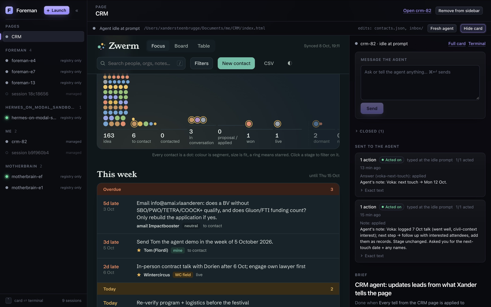

# Foreman

**Run ten Claude Codes. Read ten cards, not ten terminals.**

Foreman is a local dashboard for supervising many parallel [Claude Code](https://claude.com/claude-code) sessions. The idea behind it: **HTML should replace terminal text as the interface between you and your agents.** A terminal gives you walls of text, and the agent can never show you an image, a colour, a layout or a Yes/No button.

So every session gets one HTML surface, in two layers:

- **The card** is the same for every session. It shows what the agent is working on, how far along it is and what it needs from you. You answer by clicking, press **Send**, and Foreman delivers it the moment that agent can take it.
- **The page** is optional and specific to a project. It's a plain HTML app that the agent writes and maintains, such as a CRM dashboard. You click and edit on the page, and the agent sees what you changed.



<sub>Early UI. Left: every session, grouped by project. Middle: a CRM page the agent built and maintains. Right: that agent's card, with a message box, what you've sent it, and its brief.</sub>

When you need the real thing, one click opens the live terminal. Foreman doesn't replace Claude's TUI. Every session is a real `claude` process with slash commands, permission prompts and everything else intact. Foreman adds the surface and a way to talk back to the agent, never a replacement agent runtime.

> 🚧 **Early and personal.** macOS, single user, runs on `localhost`, nothing leaves your machine. The name is provisional.

---

## What a card shows

```
┌─ api-refactor ─────────────────────────────── ● working ─ [Pause] [Stop] ┐
│ Goal     Move auth into middleware                                       │
│ Done when all routes pass the auth test suite                            │
│ ████████████░░░░░░  62%  · ETA 15–25 min · now: fixing 3 failing routes  │
│                                                                          │
│ Needs you (2)                                                            │
│   ? Keep the legacy /v1 token path?   [Keep it] [Drop it]  default: keep │
│   ◆ Decision: jose over jsonwebtoken     [Mark reviewed] [Revisit…]      │
│                                                                          │
│ 2 staged                                                   [Send tray →] │
└──────────────────────────────────────────────────────── open terminal ↗ ─┘
```

- **Brief and progress**: the goal, the success criterion, a checklist, and the agent's own estimate of % done and ETA.
- **Items**: questions (with a default, so work keeps moving), decisions it made that you might want changed, blockers, issues, deliverables, and commands for you to run.
- **Handover**: a short review package when it finishes, so you don't have to read the transcript.
- **Steering**: stage answers in a tray, then **Send** them as one batch. You can also **Pause** or **Stop** (one ESC) the session.
- **Peers**: sessions working in the same project know about each other at startup and can message each other through Claude's own `SendMessage`.

## Pages

An agent can put a page next to its card by calling `foreman_page` on an ordinary `.html` file in its project folder. Foreman serves that folder in a sandboxed frame and reloads the frame whenever files change. There are no components, schemas or page APIs. It's just a web page that the agent edits with its usual tools.

The page has two ways to reach the agent:

| You… | What happens | Does it start an agent turn? |
|---|---|---|
| edit directly (toggle, field, delete) | the page saves one of the data files its agent declared `writable` | no. The agent gets a diff of your edits at the top of its next batch. |
| talk, or drop in a transcript | the page sends a *tell*, which arrives as a batch | yes |
| ask for a change to the page itself | a tell; the agent edits the HTML/JS/CSS | yes |

Code files can never be written by the page, so the page's behaviour only changes through the agent. Writes are whole-file replacements guarded by an ETag. If the file changed since the page read it, the save is refused and the page re-reads before trying again. The last 5 versions of each file are kept as backups.

A page is *pinned* in the sidebar and outlives its session. **Start agent** / **Fresh agent** launches a new managed Claude on the same page. The first real page is a personal CRM.

## How it works

```
  browser (React UI)
        │  auth'd HTTP · SSE · terminal WebSocket
        ▼
  foremand ── web daemon: reads the journals, builds the cards, delivers your batches
        │           + page listener on localhost:<port+1>: serves pages, saves their data files
        │
        ▼
  ptyd ────── terminal host: owns the real `claude` PTYs and outlives everything else
        │
        ▼
  claude ×N ─ each loaded with the Foreman plugin:
               • hooks log what the session is doing
               • MCP tools let it report (foreman_brief, _progress, _ask, _post,
                 _resolve, _handover, _inbox, _page, _peers)
               • a skill teaches it the protocol
        │
        ▼
  ~/.foreman/  one append-only journal per session: the only source of truth
```

A few rules keep it trustworthy:

- **Nothing is typed on a guess.** A batch goes into a terminal only when Foreman can verify the input box is idle and empty. Otherwise it waits and tells you why.
- **Unknown stays unknown.** A quiet terminal isn't assumed to be alive or ready.
- **Files are truth.** Agents can still report while the daemon or UI is down. Every database is rebuildable from the journals.
- **Private by construction.** Hooks record names, paths and counts, never your prompts or tool output.
- **Pages are walled off.** Pages run on a separate origin (`localhost`, not the daemon's `127.0.0.1`), so agent-written HTML can never reach the daemon or type into a terminal. A tell only goes through if it comes from a real click or keypress inside the frame.

## Quickstart

Requires [Bun](https://bun.sh) ≥ 1.3.5 and Claude Code.

```bash
bun install
bun run build                            # plugin bundles + UI

bun src/cli/main.ts up                   # start ptyd + the daemon (http://127.0.0.1:7717, pages on :7718)
bun src/cli/main.ts open                 # sign the browser in (one-use link)
bun src/cli/main.ts run claude           # start a managed session (detach: Ctrl-] d)
```

Managed sessions get the plugin loaded automatically. You can also launch them from the UI. To have a session you started yourself show up as a card, start it with `claude --plugin-dir <this-repo>/plugin`.

| Command | What it does |
|---|---|
| `foreman up` / `down [--ptyd]` | Start or stop the services. `--ptyd` also ends every managed agent. |
| `foreman run claude [args]` | Launch a managed Claude and attach to it |
| `foreman ls` · `attach <id>` · `kill <id>` | List, re-attach to or kill managed terminals |
| `foreman open` · `status` | Open the UI (one-use 60 s sign-in link), show service health |
| `foreman call <tool> '<json>'` | Call a protocol tool from the shell |

(`foreman` = `bun src/cli/main.ts` until it's linked.)

## Status

| | |
|---|---|
| ✅ **Host + see** | Managed terminals, hooks, journals, authenticated daemon, cards and live terminals |
| ✅ **Protocol + steering** | Agent MCP tools and skill, send tray → Send, reliable batch delivery, Pause and Stop, peers |
| ✅ **Pages** | `foreman_page`, the sandboxed Page mode, tells, page-saved data files, edit diffs on delivery, pins, Start/Fresh agent. The CRM page is built. |
| 🔨 **Now** | Trying out the CRM live with real data for a week |
| 🔜 **Next** | Rich card output: diagrams, tables and images in a coding agent's card. That's the real test of whether the card beats reading the terminal. |
| 🔜 **Then** | A global inbox across all sessions, then the full switch from the terminal multiplexer |

## Development

```bash
bun test              # all suites
bun run typecheck
bun run dev:ui        # UI with hot reload
```

Run experiments against an isolated home so they don't touch your real sessions: `FOREMAN_HOME=/tmp/fh FOREMAN_PORT=7801 bun src/cli/main.ts up`.

`CLAUDE.md` and `docs/` are written for coding agents working on Foreman. They're dense, but they're the full technical reference.

## License

MIT
