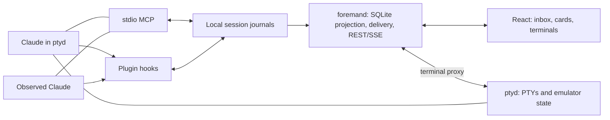

# Foreman — build plan

> **v3.3 · 2026-09-28. Phase 1 ("host + see") is built; the phase-0 spike passed every gate** —
> verdict table in §18.1. The product decisions in §19 remain authoritative; unbuilt contracts below
> are still the spec.
>
> **Phase 2 in progress.** Built: the agent protocol (§8 — contract, MCP sidecar, skill), the
> batch/claim queue on the journal, hook delivery + daemon idle worker + delivery status/Retry
> (§9.2/§9.3; live exit evidence passed 6/6), the send tray + Send/Pause/Stop + retarget/cancel and
> the phase-2 card (§9.1/§11). **Next:** peers (§10).
>
> **Open product choice (§19.1):** separate human Board. Pause/Stop and observed summaries were
> decided 2026-09-28 (§19, D18/D19).
>
> **Build:** ~~hosted terminals~~ → protocol/steering/peers → global inbox → one-week dogfood checkpoint.
> Workspace, macros, launch-next, panels and Codex wait until after that checkpoint.

## 0. Product and scope

Foreman is a local Bun daemon + React browser app that hosts real **Claude Code** terminals.
Agents push progress, questions, decisions and handovers through MCP. The human reads cards and
an inbox, answers by clicking, then presses **Send** for that session. One click opens its terminal.
The point is reducing supervision effort, not replacing Claude's TUI.

**Core:** managed sessions, observed-session hooks, passive activity, declared progress/items,
manual send trays, reliable delivery accounting, card handovers, per-project peers and a global
human inbox. A minimal launcher belongs in phase 1; handover-to-next-agent automation does not.

**Excluded:** collision warnings, Foreman agent-to-agent messaging, send timers, question
countdowns, channels, Codex support, headless jobs, terminal-host adapters and a desktop shell.
No tmux or Tauri work is scheduled. Native permission prompts stay in the real terminal.

Xander first; generic protocol, optional personal conventions; MIT; macOS required, Linux
best-effort. Data lives in `~/.foreman/`, never project repos. The name remains provisional:
recheck the unrelated Procfile runner's `foreman` CLI before publication.

## 1. Why build this

The previous history review found repeated manual handovers, model/effort changes, short steering
prompts and decisions buried in documents. Treat its counts as historical motivation, not verified
requirements. The durable implications are: explicit success criteria, progress plus current
activity, questions with defaults, visible decisions and a concise review package.

Progress is the agent's estimate (D7), not a scientific accuracy claim. Checklist completion never
computes the percentage. Show uncertainty and stale estimates honestly. Success is measured by
whether Xander actually steers sessions through Foreman during the checkpoint.

## 2. Design rules

1. **Attention first:** concise fields, collapsed detail, unread changes, and notifications only
   for high-impact/blocking items. Personal wording conventions belong in the pack.
2. **Defaults keep work moving:** proceed or park reversible work; a genuinely blocking question
   ends the turn without polling or a timeout. A default is never permission for a one-way action.
3. **Real terminals:** slash commands and permission UX remain available. Unknown state is shown
   as unknown; it is never permission to paste.
4. **Files are truth:** MCP and hooks work with the UI/daemon down. Failure to persist an update
   is visible to its caller; Foreman never claims an unrecorded action succeeded.
5. **One Send = one immutable batch:** busy delivery can enter the existing turn; idle delivery
   starts a new one. It does not mean every batch must create a turn.
6. **Small boundaries:** ptyd owns processes and terminal state; daemon owns projections/UI;
   hooks and MCP share local persistence/validation. No model work in ptyd.
7. **Local trust:** the browser can control a terminal, so authentication, origin checks and
   untrusted-content handling are core work (§16).

## 3. Objects and identities

| Object | Meaning |
|---|---|
| Project | Canonical worktree root (`git rev-parse --show-toplevel`, then realpath). Separate worktrees remain separate projects in core. Non-git cwd uses its realpath; explicit configured roots may group subfolders. |
| Session | One Claude conversation, keyed by vendor + Claude `session_id`; Foreman's stable UUID is separate from that native ID. |
| Run | One active incarnation of that conversation; fresh UUID on process restart/resume, preserved through compaction. |
| Terminal | One ptyd-owned PTY/process, with its own UUID. `/clear` or in-TUI `/resume` can change which session/run it routes to. |
| Brief / progress | Goal, success criterion, checklist, estimated percent/ETA/confidence and current activity. |
| Item / handover | Versioned structured content; card summary and review evidence. |
| Batch / receipt | Human Send payload and separate transport, model-seen and acted acknowledgements. |

Managed sessions have a live PTY. Observed sessions were started elsewhere **with the plugin
loaded**: cards and hook delivery, no Foreman-owned terminal or idle wake. An already-running
plain session does not magically acquire a newly installed plugin. Registry-only discoveries show
limited passive identity/state until enrollment. Headless jobs are post-checkpoint.

## 4. Technical verification and landscape

Checked on **2026-09-27**; local versions: **Bun 1.3.5**, **Claude Code 2.1.283**. “Verified”
means the stated API/evidence exists. Rows marked "phase 0" were re-verified live on 2026-09-28 (§18.1).

| Core claim | Verdict | Evidence and plan consequence |
|---|---|---|
| `Bun.spawn(cmd, {terminal})`, `Bun.Terminal` | **Verified locally + docs** | Tiny `/bin/sh` probe saw TTY on stdin/stdout, emitted `PTY_OK`, exited 0; `typeof Bun.Terminal` was `function`. No node-pty dependency needed for this baseline. [Bun spawn docs](https://bun.com/docs/runtime/child-process#terminal-pty-support). |
| PostToolUse context reaches the model during a turn | **Verified live (phase 0)** | `hookSpecificOutput.additionalContext` lands in the running turn. It cannot interrupt a running tool. §18.1 gate 2. |
| Stop can deliver pending input before completion | **Verified live (phase 0)** | Stop `additionalContext` continues the turn once; `decision:block` also works (fallback). Stop is not an idle listener or interrupt callback. §18.1 gate 2. |
| Bracketed paste + Enter universally starts a clean idle turn | **Wrong as a guarantee; proven with a readiness gate (phase 0)** | Only after ptyd's readiness check, as two pastes (lead + body), echo-confirmed before Enter. §9.2, §18.1 gate 1. |
| `~/.claude/sessions/<pid>.json` exists with names/state | **Verified local, private format** | Read JSON files only: observed `pid, sessionId, cwd, startedAt, procStart, version, name, messagingSocketPath`; newer rows also had `status, updatedAt`. Older rows lacked status. PID checks were sandbox-denied, so this review does not claim those entries are live. Never read `.key` files or call private sockets. |
| `SendMessage` addresses other local sessions by name | **Verified live (phase 0, §18.1 gate 5)** | Use native discovery to disambiguate names; availability and inbound acceptance depend on Claude configuration. Local messaging is documented, not just an undocumented socket trick. [Cross-session messaging](https://code.claude.com/docs/en/cross-session-messaging), [tools reference](https://code.claude.com/docs/en/tools-reference). |
| SessionStart `additionalContext` | **Verified live (phase 0)** | Arrives on startup, compact, clear and resume (§18.1 gate 3); the contract must be re-injected on each. It does not itself load a skill body. [SessionStart reference](https://code.claude.com/docs/en/hooks#sessionstart). |
| Plugin bundles hooks + MCP + skill | **Verified live (phase 0)** | `.claude-plugin/plugin.json`, `hooks/hooks.json`, root `.mcp.json`, `skills/foreman/SKILL.md`; root-relative paths use `${CLAUDE_PLUGIN_ROOT}`. Names: skill `foreman:foreman`, tools `mcp__plugin_foreman_foreman__*` (§18.1 gate 3). [Plugin reference](https://code.claude.com/docs/en/plugins-reference). |
| SessionStart supplies PID and exports identity to MCP | **Wrong assumption** | Hook JSON identifies conversation/cwd/transcript, not a guaranteed agent PID. `CLAUDE_ENV_FILE` affects later Bash commands, not an already spawned MCP server. Use §6.2 binding. |
| A 10k-line raw PTY ring reconstructs a terminal | **Wrong** | Terminal output is stateful escape sequences, not lines. Use emulator snapshots plus ordered deltas; validate restore fidelity. [xterm headless/serialization](https://github.com/xtermjs/xterm.js#nodejs-support). |
| JSONL is automatically crash-safe; hooks provide cost/context for free | **Wrong / overstated** | JSONL needs writer serialization and torn-write handling (§6.1). Cost/context are optional adapter data, not mandatory hook fields or phase-1 exit criteria. |

The retained landscape conclusion is narrow: build the structured attention layer and reuse
terminal/rendering libraries. Do not claim no competitor exists. No competitor's code is needed;
review its licence before any future reuse. SDK-hosted agents would change the real-TUI product
contract. Rich-panel protocol choices can wait until panels are authorized.

## 5. Build boundaries

Own ptyd (D3), independent of the application daemon. Closing a browser or restarting foremand
must leave agents alive. A ptyd crash can kill them; offer a new terminal using the stored native
conversation ID and `claude --resume`, never silently restart or resend work.

Source boundaries, router `CLAUDE.md` (+ `AGENTS.md` symlink) and MIT licence exist. Done — see
the repo `CLAUDE.md` layout section. Still one package/lockfile; no package-management work.

## 6. Architecture and persistence

### 6.1 `~/.foreman/` layout and write rules

Shipped: layout, directory lock with PID + process-start owner, per-session seq, torn-line repair,
read-only on interior corruption, 64 KiB lines, `request_id` idempotency, fsync for acknowledged
mutations, replay-time version validation. Done — see [reference/storage-and-identity.md](../reference/storage-and-identity.md).

**Open:** `ui/events.jsonl` now holds the send trays; human read receipts (§11) still to add, and
the file is never compacted (each tray edit appends the whole tray). The `request_id` lookup is a full-journal
scan; index it if batches make journals large. Snapshot/fsync-failure tests before claiming more durability.

### 6.2 Registration and binding

Shipped: managed launch env (`FOREMAN_TERMINAL_ID`/`FOREMAN_LAUNCH_ID`, argv only, env scrub),
SessionStart registration under a global lock, a new run + `target` per non-compact start,
compaction keeping the run, `/clear`/`/resume` rebinding (old run ended by SessionEnd, `rebound` as backstop), SessionEnd,
registry matching by exact session ID + PID/start time, daemon `bind` CAS of target onto terminal,
subagents as telemetry only. Done — see [reference/storage-and-identity.md](../reference/storage-and-identity.md).

Target injection + explicit `target` on every tool (validated current, sidecar bound to its
terminal): done — see [reference/protocol.md](../reference/protocol.md).

Retarget/cancel of batches sent to an earlier run (cancel + re-created batch on the current run in one
transaction, re-validated against current item revisions, joins the back of the queue; Pause = cancel
only): done — see [reference/protocol.md](../reference/protocol.md).

### 6.3 Plugin and passive adapter

Shipped: `plugin/` with manifest, 12 hooks, bun-finding shim and bundled hook; `--plugin-dir` for
managed launches unless a user-scoped install exists; passive activity → state (working /
waiting_permission / waiting_input / finishing / idle / dead / unknown); names/paths/counts only.
Done — see [reference/plugin-hooks.md](../reference/plugin-hooks.md).

MCP config, the `foreman:foreman` skill, the SessionStart contract (tools named for ToolSearch)
and `--allowedTools=` on managed launches: done — see [reference/protocol.md](../reference/protocol.md).

**Open:**
- Peers in the injected contract (§10).
- Observed sessions need a user permission rule for the Foreman tools (writes `~/.claude/` — ask Xander).
- Dogfood: a user-scoped install for observed sessions (`.claude-plugin/marketplace.json` exists;
  installing writes `~/.claude/`, so ask Xander). Don't replace user hooks/settings or install twice.
- Not yet observed with real payloads: PermissionRequest, Notification, StopFailure, Subagent*.
  “test failed”, cost and context percentage still need a validated adapter; omit until then.

## 7. PTY contract and terminal views

Shipped: ptyd socket protocol v1 (`hello, create, list, attach, detach, control, write, resize,
bind, kill`), headless-xterm snapshots + 4 MiB delta ring with epoch/seq replay, single writer
lease, single query responder, slow-viewer drop, UTF-8 boundary holdback, CLI `run/attach/ls/kill`
with `Ctrl-] d` detach, card/terminal switch in the UI. Done — see [reference/terminal-host.md](../reference/terminal-host.md).

**Open:**
- `input_state` / `submit` are built (phase 0). Changed from this plan's first spec: readiness is
  ptyd's own reading of its emulator rather than a daemon CAS assertion, and `submit` takes
  `attempt_id` + a one-line `lead`. Done — see [reference/terminal-host.md](../reference/terminal-host.md).
  Phase 2 adds the daemon worker that calls them (§9.2).
- launchd user services for dogfood (today `foreman up` starts detached processes); no auto-upgrade
  of ptyd while agents run.
- Resume offer when ptyd died: a new terminal via `claude --resume <native id>`, never silent.
- Observed cards: optional best-effort, read-only, on-demand transcript display.

## 8. MCP protocol and agent contract

Built: the §8.1 validation conventions, all core tools except `foreman_peers` (brief, progress,
post, ask, resolve, handover, inbox with acks), the §8.2 limits under the journal lock, the §8.3
lifecycle rules, the `foreman:foreman` skill with a generated schema reference, and the mode-specific
contract (managed = card only; observed = terminal summary + card, D19). Done — see
[reference/protocol.md](../reference/protocol.md).

Implementation choices that constrain later work: `foreman_post` carries its kind-specific fields
in a nested `body` discriminated union (MCP input schemas must be objects at the root); tool names
keep the plan's `foreman_*` names; agent-made ids validate as any 8-4-4-4-12 hex.

**Open:**
- `foreman_peers` (§10).
- `foreman_inbox.human_last_viewed_at` returns null until human read receipts exist (§11).
- Safe Markdown rendering of agent fields (§16); the card renders plain text today.

## 9. Send tray → delivery → acknowledgement

### 9.1 Human transaction

Built: the persisted per-session send tray (revision, client action ids, one staged action per item,
≤ 20 actions / 16 KiB, in `ui/events.jsonl`), the preview (= the exact frozen text + batch id), Send
via `createBatch` then clear only the sent action ids (crash between the two → reconcile by action id),
stale items shown as tray conflicts and refused on Send, Pause (a `pause` batch; "already idle" up
front on an idle observed session), Stop (daemon-only ptyd `interrupt`: one ESC while OSC 9;4 is busy,
1.5 s cooldown against a double ESC; the leftover draft is shown with a terminal link), unsent badges.
Done — see [reference/daemon-and-ui.md](../reference/daemon-and-ui.md) and
[reference/terminal-host.md](../reference/terminal-host.md).

Action union (unchanged, `BatchAction` in `protocol.ts`): `answer{item_id,item_revision,option_id?,text?}`,
`revisit`, `offer_accept|offer_decline`, `note`, `ship_ack`, plus `pause` (never staged).

**Open:** keyboard shortcuts (`s` Send, `1`–`4` answer, §11); a live Stop check against real Claude
(only the fake TUI has been interrupted by the product op; the ESC facts come from phase-0 gate 6).

### 9.2 Route and ownership

| State | Route |
|---|---|
| Working, either mode | Next successful PostToolUse injects the oldest unsent batch. Failed-tool hooks can use the same contract. Long-running tools delay delivery. |
| Normal turn ending | Stop fallback may continue once with an unsent batch. Never continue merely because a blocking question is open. |
| Managed, proven blank idle prompt | Daemon worker → ptyd `submit` (sequence below, proven in phase 0). |
| Observed idle | Leave queued: “will deliver at the next active hook.” Proven: it goes out at the Stop of the human's next turn; UserPromptSubmit could deliver earlier (untested). |
| Dialog, permission prompt, manual draft, unknown/dead/stale run | Do not paste. Show why pending and offer the real terminal/resume where available. |

All consumers claim the next batch under the same journal lock: append attempt ID, route and run
before producing side effects. Only one in-flight batch per run; FIFO for ordinary sends.
The hook and daemon cannot both claim it. Never hold a file lock while writing a PTY or stdout.
A subsequent consumer can proceed once the prior attempt finishes (transport_sent or a definitive
failure); an uncertain attempt holds the queue. Model ack is tracked separately. A crash after
claim becomes **delivery uncertain**, not automatically eligible again.

Hook output is one JSON object with `hookSpecificOutput:{hookEventName,additionalContext:text}`
(proven for PostToolUse and Stop on 2.1.283; `decision:block,reason` is the Stop fallback — it works
but shows as "Stop hook feedback"). When `stop_hook_active` is true, return without continuing again.
No generic Stop reminder and no wait-for-answer loop. PostToolBatch stays untested and off. Never
inject into a subagent hook using its parent's inbox.

**Proven delivery sequence (phase 0, Claude Code 2.1.283, fullscreen TUI):**

1. Every consumer (PostToolUse hook, Stop hook, daemon worker) claims the oldest batch under the
   session lock and appends the claim **before** any output; an unsettled claim holds the queue.
2. Hook routes print `[foreman batch <id>] <provenance line>` + the batch text as `additionalContext`.
3. Idle route: the worker reads `input_state` (ready ⇔ Claude's OSC 9;4 reports idle **and** the
   `❯` box is empty **and** bracketed paste is on), claims, then calls `submit` with that
   `input_epoch`. ptyd re-checks readiness, blocks viewer writes, pastes the one-line lead (with the
   batch marker) and then the body as **two** bracketed pastes, waits until the box shows them,
   presses `\r`, and waits for OSC 9;4 busy. `NOT_READY`/`CONFLICT` → settle the claim as failed
   (nothing was written); `uncertain` → hold the queue and show it. The spike kept claims in a
   side file (`scripts/spike/queue.ts`); phase 2 records them as session-journal events (§9.1/§9.3).
4. `UserPromptSubmit` seeing the batch marker corroborates the idle submit (transport, not model-seen).

Built: the journal events, `claimNext`/`settle`/`retryBatch`, the hook routes (PostToolUse,
PostToolUseFailure, Stop; UserPromptSubmit marker corroboration), the daemon idle worker, pause
mooting/parking and the orphaned-claim display. Exit evidence passed 6/6 live (2026-09-28, haiku,
`scripts/phase2-delivery-demo.ts`). Decisions that constrain later work: a delivered or
mooted Pause parks the sends queued before it until the human sends again; a corroborating marker
upgrades an uncertain idle submit to sent. Done — see [reference/protocol.md](../reference/protocol.md),
[reference/plugin-hooks.md](../reference/plugin-hooks.md) and [reference/daemon-and-ui.md](../reference/daemon-and-ui.md).

Why the lead: a paste over 800 chars or 4+ lines reaches the model as `<pasted_content>` data, and
Haiku then declined to act on it; the separate one-line lead keeps the instruction in the human's
own words. Readiness, draft, dialog, lease, epoch and race behaviour: §18.1 gate 1–2 and
[reference/terminal-host.md](../reference/terminal-host.md). A human holding the writer lease still
blocks delivery until release.

### 9.3 Receipts and recovery

Built: the receipt chain `queued → attempting → transport_sent → seen → acted` as separate
events, ack validation against the target's batches/actions, no regression, applied answer closes
its question, declined/blocked keeps it actionable. Done — see [reference/protocol.md](../reference/protocol.md).
**Recovery UX built:** uncertain / orphaned / 2-min-unseen deliveries show a quiet warning with an
explicit Retry (same batch/action ids, new attempt, may duplicate) on the card; nothing re-sends
itself. `delivered_via` is the claim's `route`. Done — see [reference/daemon-and-ui.md](../reference/daemon-and-ui.md).
Blocked/declined notes per item and per batch, and a terminal link next to Retry: done (card, §11).
Polling the MCP inbox can recover a missed hook payload. This provides durable queueing and
deduplication, **not exactly-once model execution**. Hook delivery and MCP reads work without
foremand; idle PTY delivery waits for its worker to return.

## 10. Per-project peers

Build peers from registered sessions' latest brief/progress plus validated native registry rows.
Exclude self, dead runs, subagent telemetry and other projects. Registry-only peers may appear
with name/state and no declared goal. Validate current PID/process-start where possible; show
unknown/stale explicitly and never reuse a cached name as a guaranteed address.

A shared reader builds the same snapshot for hooks, MCP and daemon. No model summarization.
SessionStart injects at most 5 peers and 1,200 characters total; each shows name (or unavailable),
goal, now and state, with a truncation count and instruction to call `foreman_peers` for more.
Sort active known peers first, then session UUID. The daemon refreshes its disposable cache on
relevant events and registry changes (poll at 2 s if watching is unreliable). When down, hooks/MCP
read journals/registry directly with a 100 ms budget and omit unavailable data instead of blocking.

The [native tools](https://code.claude.com/docs/en/tools-reference) perform discovery and sending
(proven in phase 0: an inbound message wakes an idle peer as a new turn wrapped in
`<cross-session-message from-name="…">`; `--name` sets the address; both tools may need permission).
If a name is ambiguous/changed, use the native listing's exact address; if messaging is unavailable,
report that capability honestly. Do not change inbound permissions, call private sockets, start
helper sessions to relay human input, or add a Foreman send tool. Native messaging may wake an
idle peer; that does not change D10's restriction on **Foreman human steering** of observed sessions.
A read-only communications feed is deferred.

## 11. Core UI and attention

**Shipped in phase 1:** projects/session list, overview cards, session card (passive state),
card/terminal switch (backtick, `t`), minimal launch form (cwd, model, effort, prompt) — see
[reference/daemon-and-ui.md](../reference/daemon-and-ui.md). **Phase 2:** the card (brief/done-when,
progress bar/ETA/confidence/now/checklist, needs-you items with staging clicks, decisions with Mark
reviewed, handover, receipts incl. declined/blocked notes, send tray, Pause/Stop, sent batches with
Retry/Move/Cancel) and unsent badges — done, same doc. **Open:** inbox, notifications, read receipts,
keys, overview tiles showing goal/progress (phase 3).

Inbox landing view; projects/session list; tabs; card/terminal switch; minimal launch form
(project/cwd, Claude model, effort, prompt). Model/effort choices are validated against the installed
CLI. No vendor selector/headless mode/macros/workspace tabs in core. A separate human Board is Q1.

Card: goal/done-when → estimated bar/ETA/checklist/now → needs-you items → decisions/deliverables →
handover → send tray. Details collapse; terminal is one click. Unavailable cost/context fields
are absent, never fabricated zeros. Card-only handover ships in phase 2; Launch next ships later.

Inbox ranking is deterministic: blocking/permission first, then high-impact, then other actionable
items; within each tier use impact high→low, reversibility one-way→easy, oldest actionable time,
then stable ID. Assumed high-impact questions become highlighted after 15 minutes. No arbitrary
multiplication of undefined quantities. Unsent trays are visible but never auto-send.

Human read receipts store item ID + revision (only after visible in the focused view), separate
from agent batch acks. New revisions become unseen. “Since you left” means revisions newer than
the last foreground visit; open unresolved items remain reachable after being read. Attention:
UI badges for ordinary updates; browser notifications only for high-impact/blocking states,
once per item revision/state escalation. Permission waiting is blocking. No low-impact unsent
tray notifications. Denied notification permission does not break the inbox.

Keys: `n` next actionable item, `1`–`4` answer, `s` Send, `t` terminal, backtick global view switch;
never capture these inside text inputs or xterm. Quiet-after-20-min means “no declared update”,
not stalled. Three consecutive tool failures show a factual warning; do not infer task failure.

## 12. Workspace — deferred

Instructions and docs editable; code read-only with editor deep links (D5). Reserve canonical
file refs and provenance. Later saves use content hashes, conflict handling and local file history;
realpath-bounded roots and symlink destinations must be explicit. Don't build a file index/editor
in phases 0–3. Future doc-decision inbox entries need origin identity and an explicit session target.

## 13. Panels — deferred

Reserve versioned item extensions. Later: approved component catalog, then sandboxed HTML if
needed. Agent content never shares the terminal UI's origin/auth privileges; panel responses use
the human tray. Protocol portability requires an actual implementation review, not merely reusing
MCP Apps method names. No catalog/shim/panel schema in core.

## 14. Macros, launch-next and style — deferred

Later saved prompts may target a session or launch a new one; handovers carry `next_prompt` now
so phase 4 can add preview/edit/launch without changing old cards. Chains must preserve explicit
send/launch intent. Personal doc conventions and prompt seeds belong in a pack. Basic core theme
is sufficient; style memory and headless jobs wait for their phases.

## 15. Distribution

MIT from the first code commit. Local development/dogfood installs Claude integration only.
Public `init/uninstall`, marketplace distribution, packs, Linux validation and name resolution
wait for a publication decision. Installer must track its changes, preserve existing settings and
remove only owned entries. No telemetry or hosted service. No Codex config edits before its phase.

## 16. Security and local access

Shipped: loopback bind, Host allowlist, exact Origin, bearer + signed SameSite=Strict cookie via
one-use launch token, owner-only socket, server-side validation, CSP, text-only rendering. Done — see
[reference/daemon-and-ui.md](../reference/daemon-and-ui.md). **Open:** safe Markdown rendering for agent
fields (phase 2), realpath-checked project links, filesystem peer-credential checks on the ptyd socket.

- Bind to `127.0.0.1`; one configured origin, Host allowlist, no permissive CORS. Protect REST,
  SSE and terminal WS. Browser mutations/WS require exact Origin and authenticated HttpOnly,
  SameSite cookie; CLI uses a bearer secret. Bootstrap the cookie with a short-lived one-use
  launch token, then remove it from the URL. Never embed the installation secret in the SPA.
- Owner-only ptyd socket; filesystem credential checks where available. Browser never gets
  direct socket access. All terminal IDs, sizes and payload limits are validated server-side.
- Render agent Markdown safely; no raw HTML, arbitrary command URLs or OSC clipboard writes.
  Project links are realpath-checked; external links use safe schemes and explicit navigation.
- Persist passive names/paths/counts, not tool bodies. Declared fields and human batches are
  intentionally stored; neither goes to general diagnostic logs. No transcript copying.
- A ship acknowledgement records what the human says they ran; it never launches a deploy.
  Native permission prompts are not answered by ordinary steering messages.

## 17. Stack and application API

Bun 1.3.5 baseline (spike-verified; pin it in `package.json` when phase 2 starts); Hono; React/Vite/Tailwind; xterm + headless/serialize;
Zod; stdio MCP SDK; JSONL journals + disposable SQLite. Monaco belongs to workspace later.
No channel-specific MCP dependency or desktop shell requirement.

Shipped endpoints: sessions list/detail (detail carries `batches`; `SessionView.delivery`), terminals
list/launch, launch-options, SSE, terminal WS, launch-token bootstrap, batch retry/cancel/retarget, tray
`PUT`, `send`, `pause`, `stop`, decision `reviewed` (detail also carries `work` + `tray`). **Open:** global
inbox, item read receipts.

Versioned local API: `GET /api/v1/sessions`, session snapshot/items, global inbox;
`PUT /sessions/:id/tray` with expected revision; `POST /sessions/:id/send` with batch ID;
`POST /items/:id/read` with session and revision; create/attach endpoints for managed terminals;
`GET /api/v1/events` SSE; `/api/v1/terminals/:id/ws` authenticated terminal proxy.
Every mutation uses shared validation and idempotency. SSE IDs use projection epoch + cursor;
reconnect replays retained events or sends `resync_required` and a fresh snapshot. Never report a
batch queued before durable storage. UI projection rebuild must retain human receipts/trays.

## 18. Build order and acceptance gates

Estimates are provisional agent-assisted working days with human feedback. Phase 0 did not move
the phase-2 estimate: its new work (lead-line framing, MCP permission wiring) is small.

| Phase | Work | Exit evidence | Estimate |
|---|---|---|---|
| **0 · Integration spike** | **Done 2026-09-28.** Every gate passed — §18.1. Terminal restore/multi-viewer were proven in phase 1. Not run: c11 wrapper coexistence (ptyd scrubs `C11_*` and skips the wrapper). | §18.1 | — |
| **1 · Host + see** | **Done 2026-09-27.** `scripts/phase1-demo.ts` (real Claude, 7/7): five managed agents register via hooks, are bound, survive a daemon restart with the same PIDs and a browser WS reconnect (replay, no snapshot); two viewers agree after resize and delta replay. Tests (38): slow viewer dropped without stalling the child; PID reuse / stale registry not live; hostile Origin/Host/cookie rejected. UI checked in headless Chrome (render, take control, type). | — |
| **2 · Protocol + steering + peers** | In progress. Done: MCP schemas, skill, contract, progress/items/questions/handover storage, batch queue + receipts (inbox acks), delivery routes (hooks + idle worker) + Retry, tray/Send/Pause/Stop + retarget/cancel, card UI (checked in headless Chrome with a fake TUI). Delivery exit evidence 6/6 (`scripts/phase2-delivery-demo.ts`). Open: peers; the real-task exit evidence below. | Real task: answer blocking question, override assumed answer, revisit decision, accept offer; agent records outcomes. Daemon-off hooks still work; no duplicate delivery claims; uncertain send stays uncertain. Native peer message demo in explicitly created test sessions. The Stop hook allows a turn to finish with no queued input instead of looping. | 5–6 d |
| **3 · Inbox + attention** | Cross-session ranked inbox, read receipts, since-away view and bounded notifications. | After 2 h away, show unseen revisions plus unresolved work, rank deterministically, retain drafts/receipts across rebuild, notify only eligible items. Resolve Q1 (Board) before its dependent UI is declared complete. | 2–3 d |

### 18.1 Phase-0 verdicts

Versions: **Claude Code 2.1.283**, **Bun 1.3.5**, macOS arm64, 2026-09-28, `--model haiku`, Xander's
fullscreen TUI, isolated `FOREMAN_HOME=/tmp/fh`. Evidence: `scripts/spike/gate*.ts` (real Claude,
each a few tiny turns — ask before running) and `claim-race.ts` / `test/ptyd-submit.test.ts` (no model).

| Gate | Verdict | Observed evidence | Failure cases found | Chosen fallback |
|---|---|---|---|---|
| 1 · Idle delivery | **PASS** (15/15) | Readiness = OSC 9;4 idle + empty `❯` box + bracketed paste. Single-line, 3-line Unicode and a 16 KiB body each started exactly one turn with one `UserPromptSubmit` carrying the marker, byte-exact; echo ≈20–40 ms, busy ≈20–50 ms after Enter. Draft → `NOT_READY` (draft untouched); typing after the read → `CONFLICT` (epoch); held lease / stale target → `CONFLICT`; permission dialog → not ready, ready again after Esc. | Title glyph shows idle during dialogs (unusable); prompt uses U+00A0; big pastes arrive as `<pasted_content>` and the model treats them as data; a multi-line draft was first misread as "no prompt" (fixed, test added). | Two-paste framing with a lead; `uncertain` holds the queue and is shown, never re-pasted. Non-fullscreen TUI untested → fails closed. |
| 2 · Mid-turn delivery | **PASS** (8/8, both Stop modes) | PostToolUse context answered in the same turn. Stop context continued the turn once; 2nd Stop had `stop_hook_active:true`, nothing claimed. Empty queue → one Stop, no loop. Busy→idle race ×4: Stop won 2, the worker won 2, never both. 8 processes × 100 contested batches: 0 duplicate claims. | `decision:block` works but shows as "Stop hook feedback" + `hook_blocking_error`. | Stop `additionalContext` primary; `decision:block` fallback. |
| 3 · Identity across lifecycle | **PASS** (13/13) | Skill loads as `foreman:foreman`; MCP tool `mcp__plugin_foreman_foreman__ping`, sidecar inherits `FOREMAN_TERMINAL_ID`. SessionStart context answered after startup, `/compact`, `/clear`, in-TUI `/resume`, process-restart `--resume`. Compact keeps run + route; `/clear` and `/resume` rebind the terminal; the old target's `submit` is refused. | MCP tools are deferred and prompt for permission; the sidecar survives `/clear`; old run ends `clear` (SessionEnd first), not `rebound`. | Contract names the tools for ToolSearch; `--allowedTools` for managed launches; explicit `target` on every tool. |
| 4 · Observed sessions | **PASS** (5/5) | Claude in its own PTY with `--plugin-dir` registers as `observed`, no terminal bound, receives a PostToolUse batch mid-turn; an idle batch stays queued (0 claims) and goes out at the Stop of the human's next turn. | — | No idle wake (D10). |
| 5 · Native peers | **PASS** (2/2) | Named session A used `ListAgents` + `SendMessage` to reach `--name`d B; B woke with `<cross-session-message from-name="fm-spike-a-…">`. | Tools need permission in manual mode. | Pre-allow in test/managed launches; report unavailability honestly. |
| 6 · Interrupt key | **PASS** (6/6 + 1 observation) | One ESC (or Ctrl-C) stops a streaming turn in ≈100 ms, process and conversation kept, no Stop hook. ESC mid-tool stops it (a background-task notice then runs a short follow-up turn). A lone ESC on an idle prompt is harmless. | ESC before the first token puts the prompt back as a draft (seen in 2 of 3 runs), blocking idle delivery until cleared. | Stop = one ESC, only while OSC 9;4 says busy; never double ESC or Ctrl-C when idle. |

Not separately run: daemon disconnect mid-submit (covered by `attempt_id` idempotency and the
file-only hook/queue path, which needs no daemon), c11 wrapper coexistence.

**Checkpoint:** dogfood for one week. Record steering actions through Foreman versus direct
terminal input and the reasons for switching. Does Xander steer most sessions from Foreman?
If not, fix the core/rethink before proceeding.

After checkpoint: **4** handover → launch-next, macros/headless jobs (3–4 d); **5** workspace and
doc decisions (4–5 d); **6** panels (2–3 d). Follow-ups: AskUserQuestion forwarding without any
auto-answer, Codex adapter, optional native communications viewer. Publication polish only on a
separate decision. No tmux/Tauri milestone.

For each built phase: relevant Bun tests/typecheck, realistic terminal/integration demos, and
`fallow audit` before committing TS/JS; broader fallow pass after a long implementation. Promote
shipped behavior into `docs/reference/`, drain this plan, update the router.

## 19. Decisions (grilled with Xander, 2026-09-27)

| # | Decision | Outcome |
|---|---|---|
| **Scope** | Who v1 is for | **Xander first**, but generic enough for others (conventions in a pack, nothing personal hard-coded). **macOS must work**; Linux best-effort. |
| **D1** | Name | **Foreman** for now (was "Bridge"). Recheck before public release: Homebrew's `foreman` (Procfile runner) could clash as a CLI binary. Other candidates considered: Crowsnest, Telltale, Ringmaster, Lookout. Pitwall and Flightdeck are out (existing Claude-session/agent-fleet tools use those names). |
| **D2** | License | **MIT** from day 1; never copy AGPL/unlicensed code. |
| **D3** | Terminal host | **Own `foreman-ptyd`**, not tmux: native scrollback, full byte-level control, no layer in between. A ptyd crash kills agents (resumable), judged acceptable. |
| **D4** | Shell / c11 | **Browser app; no Tauri planned.** c11 is neither required nor replaced; the hard requirement is **one click from card to terminal**. |
| **D5** | Workspace scope | Instructions layer + docs editable; code read-only + "Open in Cursor". |
| **D6** | Protocol surface | MCP tools primary; CLI mirror. |
| **D7** | Progress | Agent-reported bar + ETA + confidence; checklist alongside; passive sanity hints only. |
| **D8** | Question policy | Proceed on default; `park` for branchable work; `block` only for one-way doors, and **blocking = end the turn and wait** (no timeout). |
| **D9** | Agent-to-agent | **No Foreman messaging.** A per-project peers view (name + goal + now-line) and **Claude's native `SendMessage`**. No collision machinery. |
| **D10** | Sessions started outside Foreman | Visible, **steerable only while busy**; no idle wake in v1. |
| **D11** | Sending | **Manual Send button per session tab**; no timer; tab switches never send; unsent badge. `stop`/`pause` immediate. |
| **D12** | Native `AskUserQuestion` | Skill steers agents to `foreman_ask`; the forward-verbatim hook is a **post-MVP** safety net that never auto-decides. |
| **D13** | Ship ▶ Run buttons | No in v1 ("I ran it" only). |
| **D14** | Data location | Central `~/.foreman/`. |
| **D15** | Terminal summary | **None in Foreman sessions**; the handover card is the only summary (skill/pack instruction). |
| **D16** | Vendors | **Claude first**; Codex after dogfooding. |
| **D17** | Loudness | Notifications for high-impact/blocking only; everything else silent. |
| **D18** | Pause vs Stop (2026-09-28) | **Pause** = a cooperative "park now" batch (finish the step, record progress, end the turn), delivered ahead of queued sends through the normal routes — managed and observed. **Stop** = one ESC into a managed terminal, only while OSC 9;4 says busy; conversation and PTY kept. If an early ESC leaves the prompt as a draft, the card says so and offers the terminal (no auto-clear). Observed sessions get no Stop. |
| **D19** | Observed summaries (2026-09-28) | Managed = handover card only. Observed = normal terminal summary **plus** the card. |
| **Order** | Build order | Spike → core (phases 1–3) → one-week checkpoint → handover/launch-next → workspace → panels. |

### 19.1 Questions not settled by the recorded decisions

These are pending; don't treat recommendations as approval. They do not prevent phase 0.

1. **Human situation board:** D9 specifies what agents see, not whether the human gets a separate
   all-project Board. **Recommend:** defer the separate Board; use project/session rows and the
   global inbox in core. If retained, specify it as an additional view over the same projection.
2. ~~Pause versus Stop~~ — decided, D18.
3. ~~Observed-session summaries~~ — decided, D19.

## Appendix: evidence boundaries

Primary technical sources are linked at each claim in §4. Local review evidence was limited to
version/help output, Bun's no-model TTY smoke test, registry JSON field inspection and reading
`/Applications/c11.app/Contents/Resources/bin/claude`. That wrapper injects `--session-id` (unless
resuming/explicitly supplied) and a temporary `--settings` hooks file, then execs Claude. Reading
it confirms a coexistence concern, not that combined hooks or c11 ancestry work under ptyd.

During the review no Claude model sessions were launched, peer messages sent, plugin installed or
spike written (phase 1 later launched idle TUIs and two `-p` haiku smokes; the phase-0 spike ran
real haiku turns with the plugin via `--plugin-dir` only — nothing was installed). c11 integration is optional; do not copy its hook
settings or bind ptyd-owned sessions to a launcher's stale c11 surface identity.
